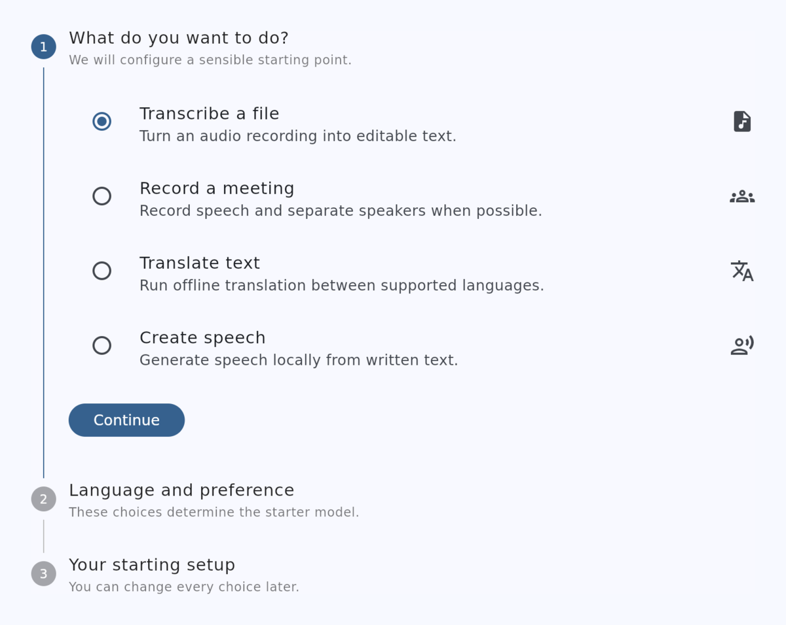
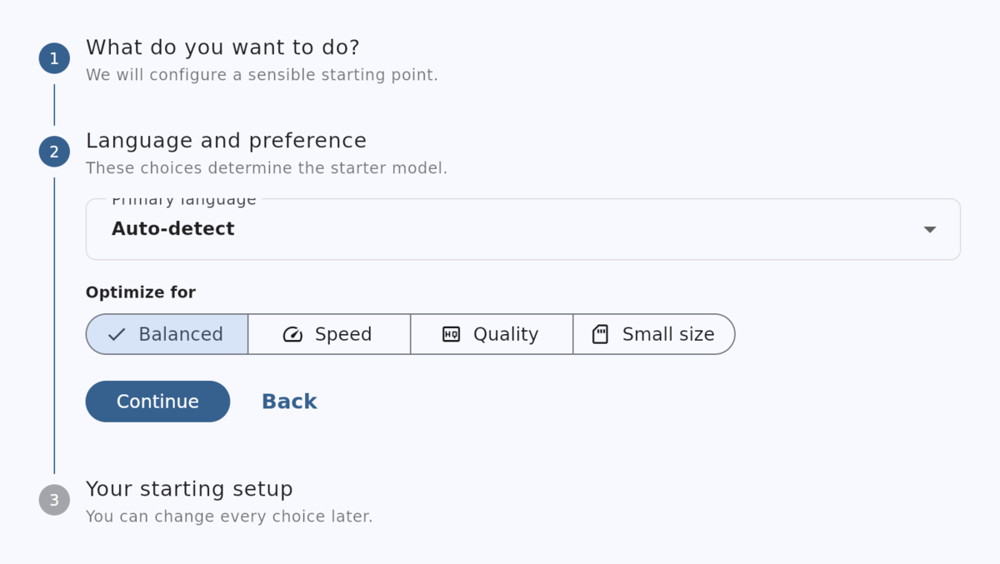
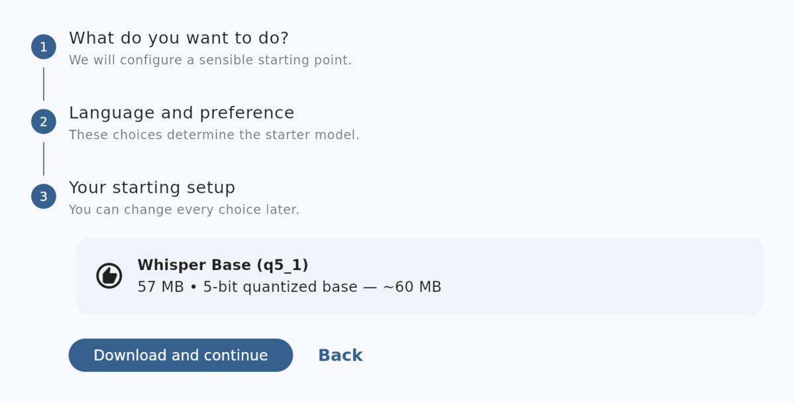
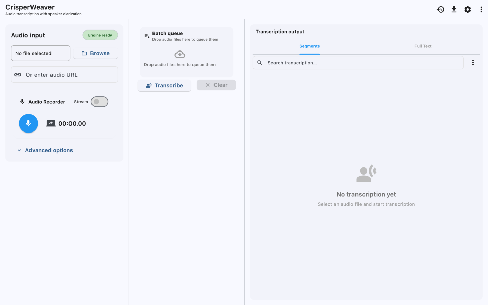
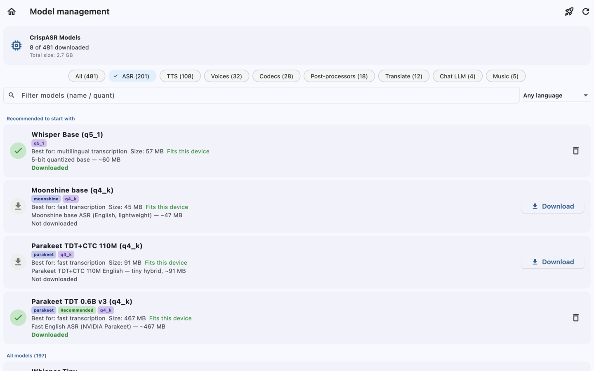
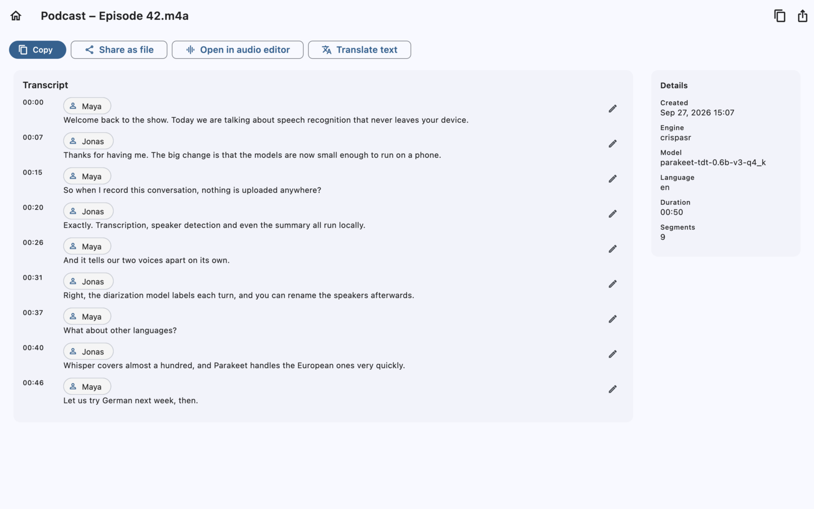
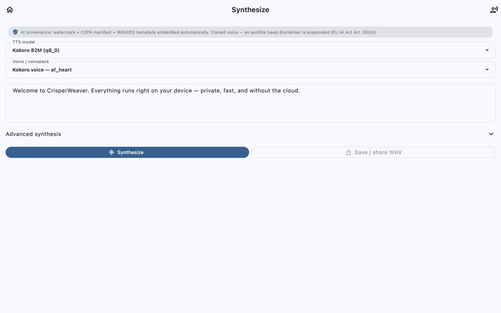
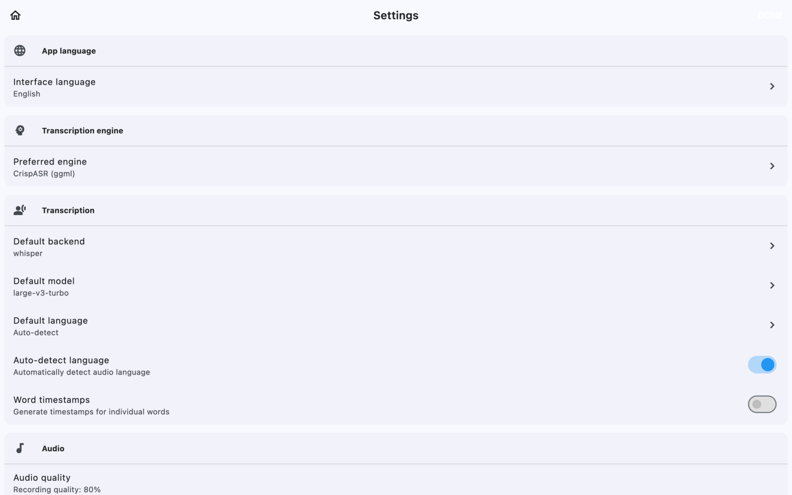

# Getting started with CrisperWeaver

A step-by-step guide from first launch to your first transcript. The
screenshots are from the macOS build, but Windows and Linux look and work
the same way. On a phone the same screens are stacked vertically, with
Transcribe / History / Settings at the bottom.

Everything runs on your computer. The only time CrisperWeaver goes online
is to download a model you pick.

## 1. Install

Download the file for your system from the
[latest release](https://github.com/CrispStrobe/CrisperWeaver/releases/latest):

| System  | File | Notes |
| ------- | ---- | ----- |
| Windows | `crisper_weaver-windows-x64.zip` | Unzip anywhere and run `crisper_weaver.exe`. |
| Windows | `crisper_weaver-windows-x64.msix` | Installs like an app and adds "Open With". See [Installing on Windows](../README.md#installing-on-windows) for the one-time *Unblock* step. |
| macOS   | `crisper_weaver-macos.zip` | Unzip and open `crisper_weaver.app`. |
| Linux   | `crisper_weaver-linux-x64.tar.gz` | Unpack and run `crisper_weaver`. |
| Android | `crisper_weaver-android-arm64.apk` | Allow installing from your browser when Android asks. |

## 2. First launch: the setup assistant

The first start opens a three-step assistant. It downloads **one** small
starter model that fits what you want to do. You can change everything
later.

**Step 1: pick what you want to do**, then press **Continue**. For a
first try, choose *Transcribe a file*.

**Step 2: language and preference.** Leave *Auto-detect* unless all your
recordings are in one language. *Balanced* is the right choice for most
computers. Pick *Speed* on an older or low-memory machine. Press
**Continue**.

**Step 3: your starting setup.** This shows the model the assistant
picked and its download size; here it is Whisper Base, 57 MB. Press
**Download and continue** and wait for the download to finish. That is the
only step that needs the internet.

*Set up later* (top right) skips the assistant. You then choose a model
yourself in step 4.

## 3. Transcribe a recording

You land on the main screen.

1. Press **Browse** and pick an audio or video file (WAV, MP3, M4A, FLAC,
   OGG, MP4 …), or drop the file onto the window. To record instead, press
   the blue microphone in *Audio Recorder*; press it again to stop.
2. Wait until the badge next to *Audio input* says **Engine ready**.
3. Press **Transcribe**. Progress shows while it runs, and the text
   appears in *Transcription output* on the right. On a phone, it appears
   in the *Output* tab.

**Start with a short recording (under a minute)** to check that
everything works before trying a long one. A long recording needs much
more memory, and the larger the model, the more memory it needs.

*Advanced options* holds language, speaker separation ("diarization"),
word timestamps and more. None of it is needed for a first run.

## 4. Choose or download other models

Open **Models** from the menu (the ⋮ or download icon at the top of the
main screen), or from **Settings → Manage models**.

- The chips at the top filter by task: *ASR* is speech-to-text, *TTS* is
  text-to-speech, *Translate* is translation, and so on. The *Any language*
  menu filters by language.
- *Recommended to start with* lists small models that run well almost
  everywhere. A green tick means the model is downloaded; press **Download**
  to fetch one, and the bin icon to delete one.
- *Fits this device* is shown in green when the model should fit into
  your memory. A model marked as too large will likely be slow or fail.
- Good first choices: **Whisper Base** (99 languages, small), and
  **Parakeet TDT 0.6B v3** (fast and very accurate for English and 24
  other European languages).

## 5. Work with the result

Every transcription is saved in **History** (bottom bar or menu). Open
an entry to read it, correct text with the pencil icon, rename speakers,
copy it, translate it, or export it as TXT, SRT, VTT or JSON with
**Share as file**.

## 6. Text to speech

Open **Synthesize** from the menu. It needs a TTS model: the setup
assistant downloads one if you chose *Create speech*; otherwise get
*Kokoro 82M* under **Models → TTS**. Type text, choose a voice and press
**Synthesize**. **Save / share WAV** exports the audio.

## 7. If something goes wrong

- **"No model downloaded" or nothing happens on Transcribe:** open
  *Models* and check that at least one *ASR* model has a green tick.
- **A download fails:** check your connection and retry. A proxy or
  firewall that blocks `huggingface.co` stops all model downloads.
- **The app, or the whole computer, freezes during a long file:** that
  usually means the computer has run out of memory. Try the same file
  with a smaller model (Whisper Base), or try a short file first.
- **Reporting a bug:** *Settings → Open log viewer* shows what the app
  was doing. *Settings → About CrisperWeaver → Review diagnostics report*
  prepares a report with personal details removed, which you can review
  before attaching it to a
  [GitHub issue](https://github.com/CrispStrobe/CrisperWeaver/issues).
  Please include your system (e.g. Windows 11), how much memory it has,
  the model you used, and how long the recording was.
